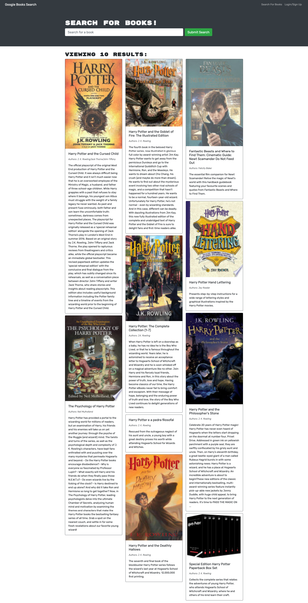

# Book Search Engine
  ### 

  ## Table of Contents:
  - [License](#license)
  - [Description](#description)
  - [Installation](#installation)
  - [Usage](#usage)
  - [Screenshot](#screenshot)
  - [Questions?](#questions)

  ## License
  ### https://opensource.org/licenses/MIT

  ## Description
  ### The purpose of this project was to take a fully functioning Google Books API search engine built with RESTful API and refactor it to be a GraphQL API built with Apollo Server. The app was built using the MERN stack, with a React front end, MongoDB database, and Node.js/Express,js server and API. 

  ## Installation Instructions
  ### To use on your local machine, you will need to have MongoDB installed. Once the database has been installed, open the integrated terminal within the root package.json file within VS code. Run npm install to download all necessary dependencies, then npm start to start the Atlas server. 

  ## Usage
  ### Once the application is open using the [heroku link](https://peaceful-ocean-99415.herokuapp.com/), the user can search for books using the main search bar. Once the user creates a profile, they can also save any searched books to be viewed later within the Saved Books link. The user can also delete books from their profile within Saved Books.

  ## Screenshot
  ### 

  ## Questions? Reach me here:
  ### https://github.com/ddouglas86
  ### test@gmail.com
